# iot-python-2026
IoT 개발자 파이썬 리포지토리

## 1일차

### 사전 정리

사전 C/C++ 학습완료. 프로그래밍 문법 파악 중

기본 문법
- 변수, 데이터형
- 연산자
- 제어문
    - 조건문
    - 반복문
- 함수/메서드
- 배열 개념
- 포인터/참조 개념 - 포인터없음
- 구조체 - 구조체없음
- 객체지향 클래스 
- 파일 입출력
- 예외처리

다른 언어는 새로 다시 공부해야 한다보다, 필요한 것만 보충 학습하겠다고 생각할 것

### 이론적 개념 정리

#### 파이썬에 신경 안써도 되는 것
- 학습 난이도를 낮추는 목록
    - 자료형 선언 안 함 
    - 세미콜론 없음(옵션으로 사용 가능)
    - 중괄호 없음 - `들여쓰기를 신중히`
    - `int main()` 강제 아님 - 비슷한 기능은 있음
    - 메모리 할당/해제 거의 안 함
    - 헤더 파일 개념 없음
    - 컴파일 과정 신경 거의 안 씀
    - 개발환경 설정 어렵지 않다

- 문법 비교표

    |이론개념|C/C++|Python|
    | --- | --- | --- |
    | 출력 | printf(), cout | `print()` |
    | 변수 선언 | int a = 10; | `a = 10` |
    | 조건문 | if (a > b) { ... } | `if a > b:` |
    | 반복문 | for (int i = 0; i < 10; i++) {} | `for i in range(10):` |
    | 함수 | int add(int a, int b) {} | `def add(a, b):` |
    | 배열 | int arr[5] | `list` |
    | 문자/문자열 | char, char[], char*, string | `str` |

- 장점
    - 들여쓰기가 코드 블록, {} 불필요
    - 선언이 없음
    - 리스트가 배열보다 훨씬 편하고 간결
    - 문자열 처리 간단
    - 함수 만들기 간단

- 단점
    - 상대적으로 느림
    - 들여쓰기 문제 가능성(공백 하나로도 문법오류)
    - 파일명 지정 시 클래스명과 동일하게 사용하면 문제발생
    - 디버그 콘솔이 여러개 실행 가능 > 하나만 실행되도록 정리
    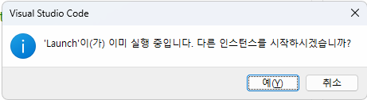
    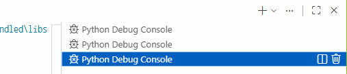
    
### 파이썬 설치

- https://python.org - 다운로드
    - 최신버전 설치 지양. 3.12 버전 
    - ~~Python install manager 클릭~~

    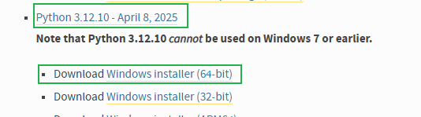

    - 3.12 페이지 검색, Windows installer (64-bit) 클릭

- 설치
    - 아래와 같이 설치

    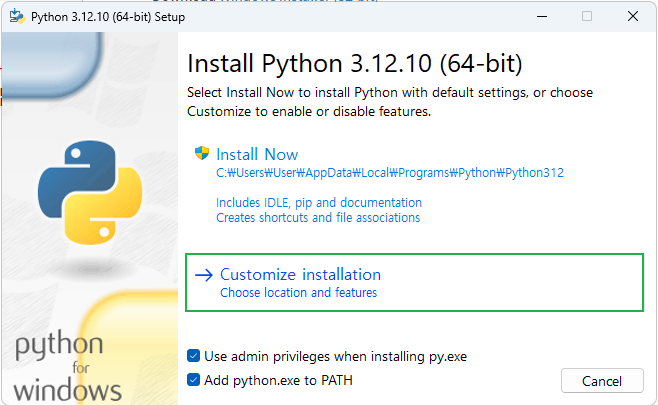

    - 다음에서 Documentation 만 체크 해제
    - Advanced Options에서 Install Python 3.12 for all users 활성화
    - Install 시작
    - 설치 후

    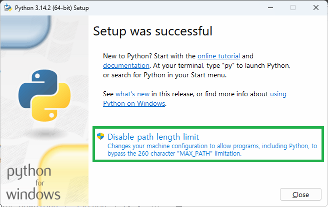

    - 윈도우 디렉토리 Path 길이 260자 제한되어 있음. Linux/MacOS 등과 호환시 문제 발생 

    - 콘솔에서 확인 안되면 시스템 속성(sysdm.cpl) 에서 Path 확인할 것

    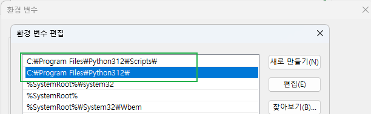

### VS Code 확장
- 확장
    - Python으로 검색 후 설치

    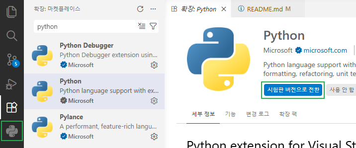


    - Jupyter 검색 후 설치

    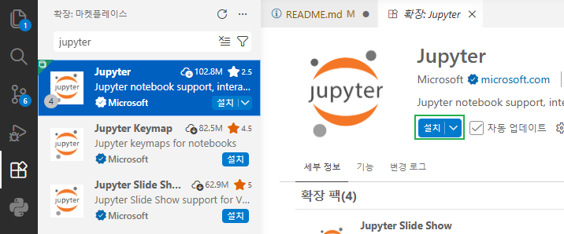

### 깃허브 확장
- 웹 코딩 환경
    - https://github.com -> com을 dev로 변경 실행 
    - visual studio code와 동일한 화면으로 변경
    - 주피터 노트북으로 데이터분석 등을 깃허브에서 바로 개발할 때 활용
    - Google colab과 동일
    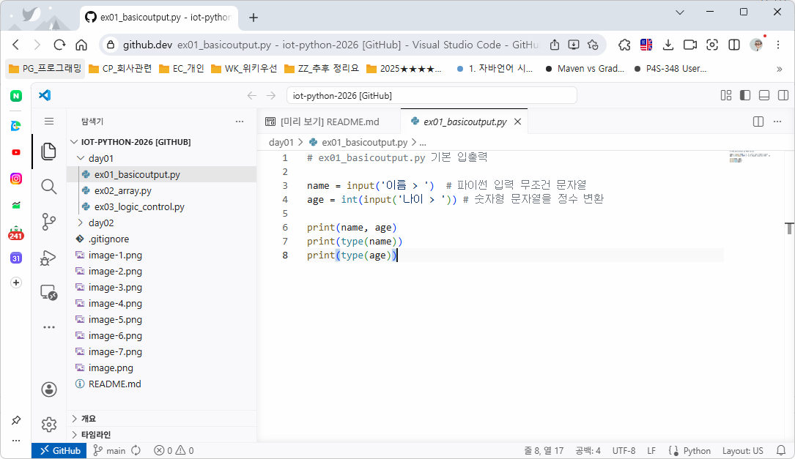

### 파이썬 기본 학습

1. 기본 입출력 - [소스](./day01/ex01_basicoutput.py)
    - .py 파일 작성
    - Ctrl + F5 실행
    - 디버거 선택 > `Python Debugger` 선택

2. 리스트(배열 대체) - [소스](./day01/ex02_array.py)
    - 어떤 데이터타입도 추가 가능
    - append ~ sort 까지 11개 함수만 학습

3. 제어문 - [소스](./day01/ex03_logic_control.py)
    - if, for
    - switch~case 문 없음 

## 2일차

### 파이썬 기본 학습

4. 변수,자료형 [쿼리](./day02/ex01.variable.py)
    - 선언이 없고 자료형을 지정안함
    - 자료형 자체를 사용안함,형변환 필요
    - 기본자료형 int,flaot,str,bool,NoneType(NULL과 거의 똑같은 기능)

5. 연산자 [쿼리](./day02/ex02.operator.py)
    - 사칙연산,할당연산,비교연산,이진연산,논리연산,멤버십연산
    - 연산자 우선순위 : 거듭제곱 > 곱셈,나눗셈 > 덧셈,뺄셈 , ()로 연산자 우선순위 설정

6. 문자열 [쿼리](./day02/ex03.string.py)
    - C방식 문자열 처리 가능
    - 여러 문자열 출력방식 존재,f-string 사용 추천
    - 포맷팅 기법

7. 함수 [쿼리](./day02/ex04.function.py)
    - 객체지향언어 함수 -> 메서드로 호칭
    - 파이썬은 함수로 호칭
    - C와 유사하게 함수 사용 전에 선언
    - def로 선언 파라미터 괄호 뒤 : 사용

8. 파일 입출력 [쿼리](./day02/ex05.fileio.py)
    - C/C++과 모드가 동일 rwa
    - with 구문으로 close()생략 가능
    - 쓰기 각 문장 끝 '\n' 추가
    - 기본적으로 UTF-8
    - 엑셀.csv 등 읽기에 많이 사용
    - CSV,JSON,텍스트파일 등 읽기에 많이 사용

9. 여기까지 배우고 활용하는 분야도 존재
    - 데이터 분석,머신러닝,딥러닝 

10. 연습
    - 구구단 [쿼리](./day02/pr02.gugudan.py)
    - 자판기 [쿼리](./day02/pr01.vending.py)

11. 외부 라이브러리 사용 
    - 파이썬 표준 라이브러리
    - 외부 라이브러리 - pip로 설치하는 3rd-party에서 개발된 라이브러리
    - C/C++ `include` -> python `import`
    - import : 모듈과 클래스를 모두 기재
    - from ~ import ~ : 클래스명만 기재
    - 라이브러리(모듈).클래스.함수() 형태로 존재

## 3일차

### 파이썬 기본 학습

11. 라이브러리 사용 계속 [소스](./day03/ex01.out_package.py)
    - 타언어의 경우 웹 검색,다운로드,개발위치 설치나 복사
    - CPU 아키텍처에 따라 32bit(x86),64bit 마다 설치방법 상이
    - 파이썬은 자신만의 패키기 관리자 pip 사용
    - 웹 검색(https://pypi.org/) 후 pip명령어로 각 파이썬 개발환경에 맞춰서 설치
    - 패키지 > 라이브러리 > 모듈

    ```bash
    > pip install requests
    ...
    > Successfully installed ...

    > pip list
    ```
    - CSV  라이브러리 [소스](./day03/ex02.csv_package.py)

12. 기타 자료구조 [소스](./day03/ex03.datastruct.py)
    - 리스트 외 튜플,딕셔너리,셋 등 ...
    - 각 자료구조 형태를 구분

13. main [소스](./day03/ex04.main.py)
    - 파이썬은 main함수가 필요없음
    - 여러 파일 중 시작점을 지칭할 때는 사용
    - `__name__` 특수변수를 사용

13. 가상환경(virtual environment)
    - 프로젝트마다 파이썬 환경을 따로 사용하기 위해 만들어진 개념
    - 프로젝트 생성 시 독립된 파이썬,라이브러리 세트 새로 생성
    - 실제환경 C:\Program Files\Python312 와 비교
    - 일반적으로 프로젝트 폴더에서 생성

    - 파워쉘 실행정책 변경 필요(관리자모드)

    ```bash
    > Set-ExecutionPolicy -ExecutionPolicy RemoteSigned
    ```
    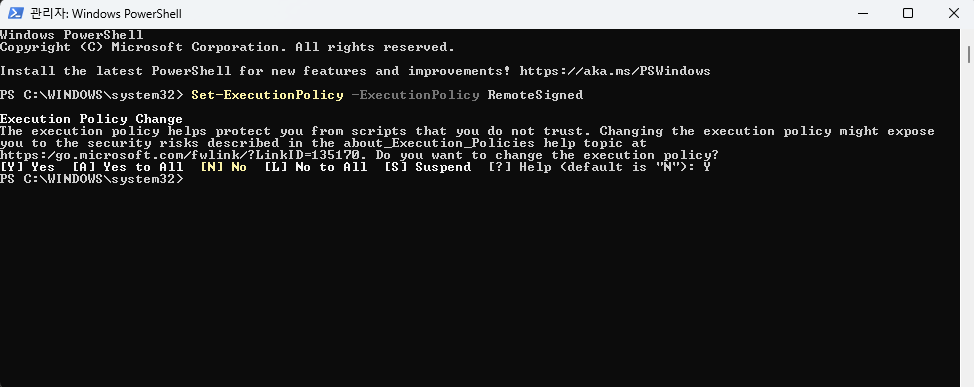

    
    - 가상환경 생성
    ```bash
    > python -m venv 가상환경이름 
    ```

    - 가상환경 생성 후 가상환경 활성화해야함 
    ```bash
    > .\iot-venv\Scripts\activate.ps1
    io치고 tab하면 알아서 입력됨
    ```
    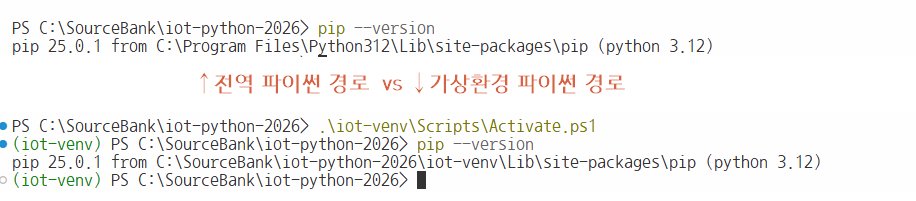
    - 가상환경은 github에 올리지 말 것
    - .gitignore에 가상환경 폴더명 추가할 것, 폴더명\

14. 객체지향 [소스1](./day03/ex05.oop.py), [소스2](./day03/ex06.opp.py),[소스3](./day03/ex07.opp.py)
    - C++의 객체지향,클래스와 동일
    - 접근제한자가 없음(public,privated,protected)
    - C++과 달리 new 안 씀, 변수 선언에 제약사항이 많이 없음
    - 클래스 내의 모든 함수의 파라미터는 self로 시작, C++의 this와 동일
    - 호출시에는 self를 사용 X
    - 파이썬의 철학 : `막지 말고 알아서 지켜라`
    - public,private(__로 변수 선언),protected(__변수 선언) C++처럼 접근제한자를 많이 사용안함

15. 예외처리 [소스](./day03/ex09.exception.py)
    - 비정상적인 종류를 막는 기능
    - try -except - finally 로 구분지어서 사용(else는 잘 사용안함)
    - except를 여러 번 쓸 수 있으나,`except Excetion as e` 하나로 동일해도 무방
    - 예외처리가 발생하면 처리속도가 늦어짐, 비정상종료를 막기위한 부분


#### 파일 입출력
- 인코딩
    - EUC-KR : 2바이트 한글 완성형 인코딩, CP949 동일한 의미 
    - UTF-8 : 1바이트 영문, 3바이트 한글, 4바이트 이모지 국제어표준 가변유니코드
    - 대한민국 데이터 포털 제공하는 CSV는 EUC-KR 사용중 , UTF-8 변환 필요

- CSV [쿼리](./day02/ex06.csv_read.py)
    - 엑셀과 호환가능한 텍스트파일
    - 텍스트 양이 많으면 한번에 읽을 수 없음. 한 줄씩 나눠서 읽어야 함
    - 보통 csv 라이브러리 사용

- JSON
    - JavaScipt Object Notation : 자바스크립트에서 데이터를 사용하기 위해 만든 표기방법
    - 딕션너리를 텍스트화 
    - 데이터를 네트워크로 전달할 때 가장 효율적인 형식
    - XML을 대체하는 기술 
    - 저장된 json 파일을 사용 또는 openAPI 네트워크로 전달된 데이터를 사용

### 주피터 노트북
- 주피터 노트북 [소스](./day03/ex20_jupyter_start.ipynb)
    - 파이썬을 좀 더 인터렉티브하게 사용하고자 하는 취지
    - 논문처럼 글과 소스 실행을 병행
    - Project Jupyter 
    - 확장에서 Jupyter 설치

- 사용법
    - ctrl shift p 
    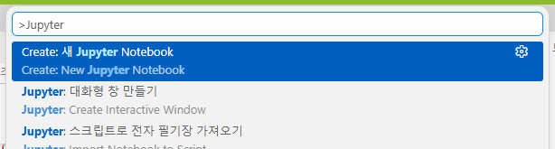

    - Untitled-1.ipynb 파일 생성, 파일 저장 우선
    - 커널 선택 클릭
    - 마크다운쉘(일반적인 설명글),코드쉘(소스코드 작성)로 구분
    - 설치(실행 최초 한번만 뜸) 
    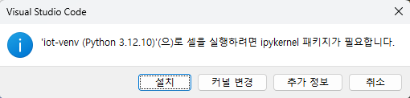

- 주피터 노트북 단축기
    - a : 현재 쉘 위에 코드쉘이 추가됨
    - b : 현재 쉘 아래에 코드쉘이 추가됨
    - enter : 현재 쉘 편집모드로 진입(커서 깜빡임 확인)
    - ctrl enter : 마크다운쉘은 빠져나오기,코드쉘을 실행
    - l : 쉘 선택모드에서 라인번호 표시
    - dd : 쉘 선택모드에서 쉘 삭제

- 사용처
    - 웹상에서 동작하므로 많은 서비스를 지원, 로컬 컴퓨터보다 속도는 느림
    - github codespace[주소](https://github.com/features/codespaces) - 기존 리포지토리와 연결 지원(무료일 경우 한달 140시간)
    - google colab[주소](https://colab.research.google.com/) - 구글에서 지원하는 노트북서비스, 90분 연결무료, 기능 제약적
    
### 데이터 분석 기초
- [소스](./day03/ex21.dataprocess.ipynb)
- 분석용 기초이롬
    - --리스트,튜플,딕셔너리--
    - 리스트 컴프리핸션
    - 파일 입출력
    - NumPy
   

## 4일차 

### 데이터 분석 기초
- [소스](./day03/ex21.dataprocess.ipynb)
- 분석용 기초이롬
    - NumPy
    - pandas
    - Matplotlib
    - seaborn
    - folium
    - wordcloud
    - 기초 통계
    - 데이터전처리